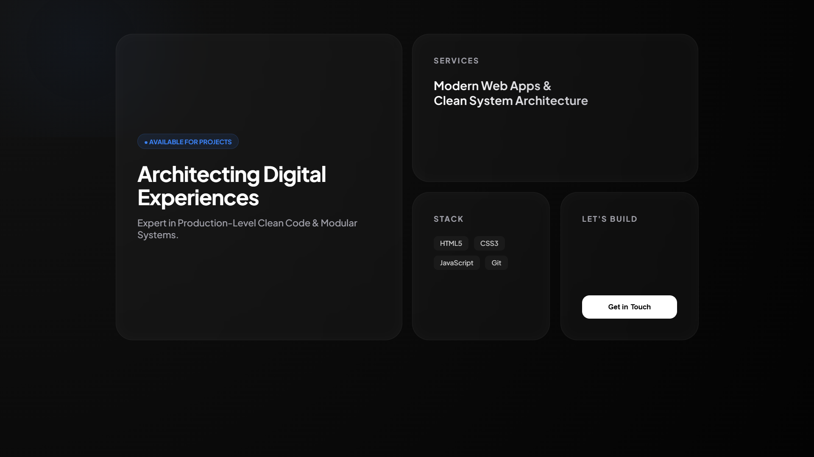

# BentoArchitect - Premium Portfolio Template
A high-end, production-ready Bento grid portfolio designed for 2026 design trends.

## 🚀 Live Demo
[https://bentoarchitect-studio.github.io/premium-bento-portfolio-template/]

## ✨ Features
- **Modern Bento Layout:** Modular and responsive design.
- **Component-Based:** Built with explicit feature audits to prevent code-breaks.
- **Minimalist Aesthetic:** Professional dark-mode UI.
- **Fast Loading:** Zero heavy frameworks, just pure HTML5 & Modular CSS.

## 🛠️ How to Use
1. Clone or download the source code.
2. Update your details in `index.html`.
3. Deploy to GitHub Pages or any hosting.

## 💰 Purchase & Support
Support the studio on Gumroad:
[https://bentoarchitect.gumroad.com/l/image-pro-tool)

---
Developed by **BentoArchitect Studio**
